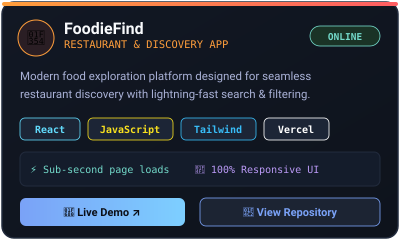
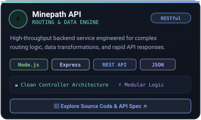
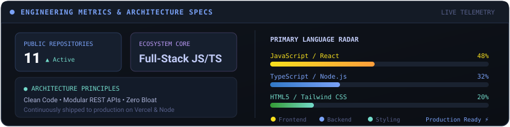

  <!-- Header Typing Animation Banner -->
  

  

    
    
    
    
  

 

<!-- Interactive Visual Developer Terminal -->

  

 

---

### 🚀 Tech Arsenal

  
<b>⚡ Languages &amp; Frontend Ecosystem</b>

  

    

  
<b>⚙️ Backend, Databases &amp; Cloud Tools</b>

  

 

---

### 🌟 Featured Engineering Projects

  <table border="0" cellspacing="12" cellpadding="0">
    <tr>
      <td width="50%" align="center" valign="top">
        
      </td>
      <td width="50%" align="center" valign="top">
        
      </td>
    </tr>
  </table>

 

---

### 📊 System Telemetry & Architecture

  

 

---

### 📫 Connect With Me

  
  &nbsp;
  
  &nbsp;
  
  &nbsp;
  

 

  Crafted with ⚡ and passion by <b>Nguyen Dang Duy Le (duynamiq)</b> • Constantly striving for engineering excellence

