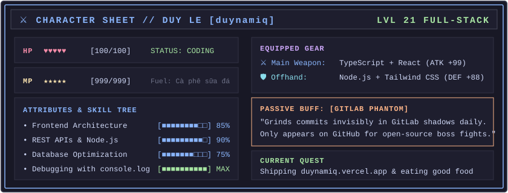

  <!-- Retro RPG Character Sheet (Flat Colors, No Gradients) -->
  

    

  

    <a href="https://duynamiq.vercel.app"><b>🌐 duynamiq.vercel.app</b></a> • 
    <a href="https://www.linkedin.com/in/duy-le-nguyen-dang-199b42328/"><b>💼 LinkedIn</b></a> • 
    <a href="mailto:dangduyle2005@gmail.com"><b>📫 dangduyle2005@gmail.com</b></a>
  

---

### 🕹️ The Story So Far

I'm **Nguyen Dang Duy Le** (aka **duynamiq**), a full-stack engineer from Ho Chi Minh City, Vietnam. I like turning complex problems into fast, intuitive, and clean web applications.

- 💼 **Where I build:** Most of my production code lives on **GitLab**, while this GitHub account is my workshop for side quests, open-source projects, and experiments.
- ⚡ **What I enjoy:** Architecting REST APIs that stay fast under load and building frontend interfaces that don't make users think twice.

---

### 🌟 Selected Projects

| Project | What It Is | The Stack | Check It Out |
| :--- | :--- | :--- | :--- |
| **🍔 FoodieFind** | Restaurant & dining discovery web app built to solve the ultimate developer dilemma: *"What are we eating tonight?"* | React, JavaScript, Tailwind CSS, Vercel | [🌐 Live Demo](https://6-2-hd-one.vercel.app) · [📂 Repo](https://github.com/DangDuyLe/FoodieFind-Restaurant-Food-Discovery) |
| **⚡ Minepath API** | High-throughput backend routing and data pipeline engine with modular controller architecture. | Node.js, Express, REST APIs | [📂 Repo](https://github.com/DangDuyLe/minepath-api) |

---

### 🎮 Developer Lore & Side Quests

- 🍜 **True Story:** FoodieFind exists because deciding what to eat in Saigon is genuinely harder than configuring Webpack from scratch.
- ☕ **Fuel Source:** `Cà phê sữa đá` > any energy drink known to mankind.
- 🐛 **Favorite Debugger:** `console.log("here 1")` followed 30 seconds later by `console.log("WAIT WHY IS IT REACHING HERE")`.
- 🎧 **In My Headphones:** Lo-Fi beats, Synthwave, and 80s City Pop when deep in flow state.

---

### 🛠️ Tech Arsenal

- **Languages:** TypeScript, JavaScript, HTML5, CSS3, SQL
- **Frontend:** React, Next.js, Tailwind CSS
- **Backend & Data:** Node.js, Express, RESTful APIs, PostgreSQL, MongoDB
- **Tools:** Git, Docker, Postman, Linux, Vercel

---

### 📬 Say Hi!

Always up for interesting engineering discussions, freelance gigs, or good food recommendations in Saigon:

- **Portfolio:** [duynamiq.vercel.app](https://duynamiq.vercel.app)
- **LinkedIn:** [duy-le-nguyen-dang-199b42328](https://www.linkedin.com/in/duy-le-nguyen-dang-199b42328/)
- **Email:** [dangduyle2005@gmail.com](mailto:dangduyle2005@gmail.com)
- **GitHub:** [@DangDuyLe](https://github.com/DangDuyLe)
